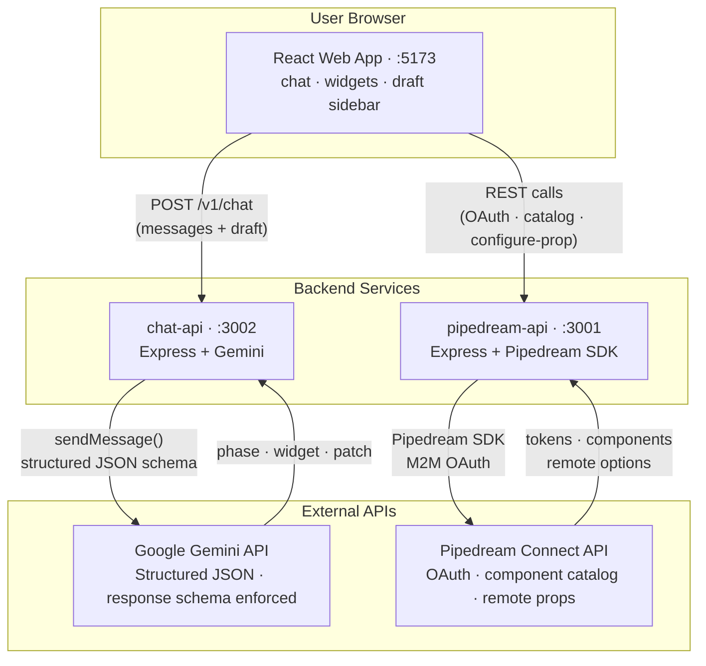
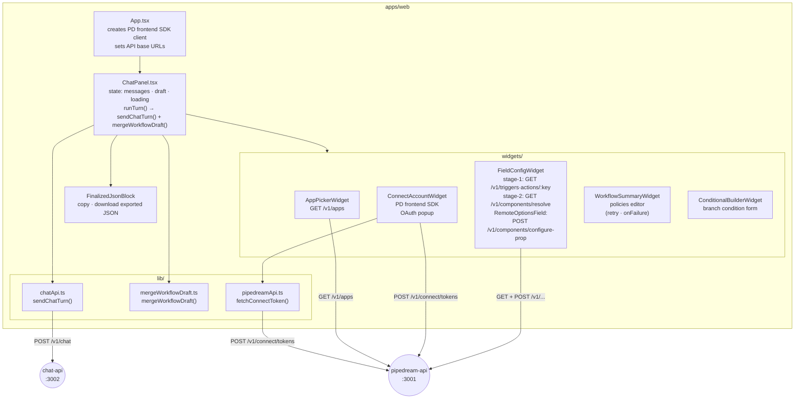
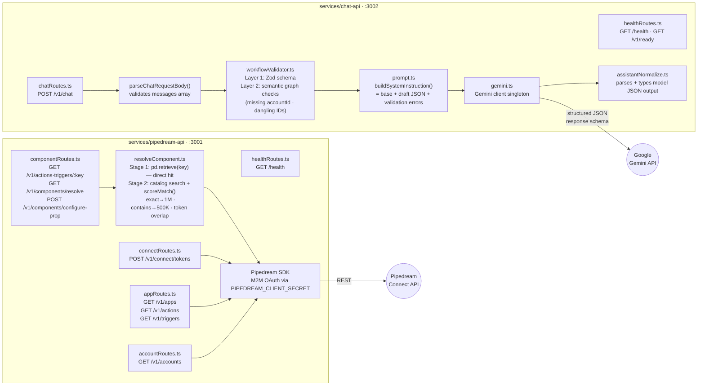

# AnyReach AI Workflow Builder

A chat-driven workflow authoring tool. Describe what you want to automate in plain language; the LLM guides you through connecting apps, configuring triggers and actions, and produces a fully-resolved, exportable workflow JSON ready for a headless runner.

---

## Table of Contents

- [What It Is](#what-it-is)
- [Prerequisites & Account Setup](#prerequisites--account-setup)
- [Environment Configuration](#environment-configuration)
- [Running Locally](#running-locally)
- [High-Level Architecture](#high-level-architecture)
- [Low-Level Architecture](#low-level-architecture)
- [Key Architectural Decisions](#key-architectural-decisions)
- [Bonus Features](#bonus-features)
- [Known Limitations](#known-limitations)
- [Happy Flow: Google Sheets → Slack](#happy-flow-google-sheets--slack)
- [API Reference](#api-reference)

---

## What It Is

AnyReach Workflow Builder lets users create multi-step automations entirely through a chat interface, without writing code or navigating a visual canvas. A Gemini LLM acts as the authoring brain, progressing through four structured phases:

| Phase | What happens |
|---|---|
| **clarify** | LLM understands the goal, apps, and data flow |
| **configure** | LLM proposes a trigger and steps; widgets collect OAuth and field values |
| **summarize** | LLM presents the full workflow for review; user can adjust error-handling policies |
| **finalize** | Draft passes validation and exports as a self-contained workflow JSON |

The UI surfaces interactive **widgets** at each step — app pickers, OAuth connect flows, dynamic prop forms, conditional branch builders, and a final summary card — so users never need to leave the chat.

---

## Prerequisites & Account Setup

### 1. Node.js

Node.js **v20 or later** is required (the backends use native ESM `--input-type=module`).

```
node --version   # must be >= 20
```

### 2. Pipedream Account (free tier is sufficient)

1. Sign up at [pipedream.com](https://pipedream.com)
2. Create a new **Project** (any name)
3. Open **Project Settings → Connect** and note:
   - **Client ID** — `PIPEDREAM_CLIENT_ID`
   - **Client Secret** — `PIPEDREAM_CLIENT_SECRET`
   - **Project ID** — `PIPEDREAM_PROJECT_ID` (looks like `proj_XXXXXXX`)
4. Leave `PIPEDREAM_PROJECT_ENVIRONMENT=development` for local use

### 3. Google AI Studio (Gemini API key)

1. Go to [aistudio.google.com/apikey](https://aistudio.google.com/apikey)
2. Create an API key — this is `GEMINI_API_KEY`
3. Note which models your key can call (free tier varies; `gemini-2.0-flash` and `gemini-1.5-flash` are widely available). Set `GEMINI_MODEL` accordingly.

---

## Environment Configuration

Copy the example file and fill in your credentials:

```bash
cp .env.example .env
```

```env
# Browser CORS origin (match wherever you run Vite)
WEB_ORIGIN=http://localhost:5173

# Pipedream Connect — from Project Settings → Connect
PIPEDREAM_CLIENT_ID=<your-client-id>
PIPEDREAM_CLIENT_SECRET=<your-client-secret>
PIPEDREAM_PROJECT_ID=<your-project-id>
PIPEDREAM_PROJECT_ENVIRONMENT=development
PIPEDREAM_API_PORT=3001

# Gemini — from Google AI Studio
GEMINI_API_KEY=<your-api-key>
GEMINI_MODEL=gemini-2.0-flash   # or gemini-1.5-flash, gemini-2.5-flash
CHAT_API_PORT=3002
```

> **Never commit `.env`.** The `.gitignore` already excludes it.

---

## Running Locally

Install dependencies once (npm workspaces installs all three packages):

```bash
npm install
```

Start all three services concurrently:

```bash
npm run dev
```

This runs:

| Process | URL | Description |
|---|---|---|
| `pipedream-api` | `http://localhost:3001` | Pipedream Connect proxy, app catalog, component resolution |
| `chat-api` | `http://localhost:3002` | Gemini LLM chat turns |
| `web` (Vite) | `http://localhost:5173` | React frontend |

Open `http://localhost:5173` and start describing a workflow.

### Run tests

```bash
npm run test --workspaces   # all packages (88 tests)
npm run test --workspace=apps/web
npm run test --workspace=services/chat-api
npm run test --workspace=services/pipedream-api
```

---

## High-Level Architecture



**Data flow summary:**
1. User types a message → web app sends the full conversation history and current workflow draft to **chat-api**
2. chat-api builds a system instruction (with draft + validation errors), calls **Gemini**, and returns a structured turn (message, phase, widget hint, draft patch)
3. Web app merges the draft patch and renders the appropriate **widget**
4. Widgets interact directly with **pipedream-api** for OAuth tokens, app search, component retrieval, and live dropdown options
5. When the user completes a widget, the result is appended to the chat and the cycle repeats
6. On `phase=finalize` the web app surfaces the export-ready **workflow JSON**

---

## Low-Level Architecture

### Web App



### Backend Services



---

## Key Architectural Decisions

### 1. Chat-native authoring with structured LLM output

**Decision:** Gemini is given a strict JSON response schema (enforced by `responseMimeType: "application/json"` and `responseSchema`) so every model response is a machine-readable turn object — not free-form prose with embedded JSON.

**Why:** Free-form extraction is fragile; a schema guarantee means the frontend never needs to parse or guess. The response shape (`message`, `phase`, `widgetKind`, `workflowPatchJson`) is designed so each field has a single, unambiguous responsibility.

**Trade-off:** The model's creative range is slightly constrained. Long, nuanced assistant messages have to fit within the `message` string field. In practice this has not been a limitation for workflow authoring.

---

### 2. Incremental draft on the client, patches from the server

**Decision:** The canonical workflow draft lives in React state on the client. The LLM never returns the whole draft — it returns a `workflowPatch` (partial update). The client merges this with `mergeWorkflowDraft()`.

**Why:** Sending the full draft back every turn would waste tokens and risk the LLM silently clobbering fields it wasn't asked to change. Patches also make it natural to send the current draft to the LLM each turn (as context) without creating a round-trip where the model re-emits it.

**Trade-off:** The client must be the merge authority. The merge function must be carefully tested (it is — 14 unit tests) to avoid silent overwrites of user-provided values like `accountId`.

---

### 3. Two separate backend services

**Decision:** The LLM logic (`chat-api`) and the Pipedream integration logic (`pipedream-api`) are separate Express services rather than a single monolith.

**Why:**
- **Secret isolation:** `GEMINI_API_KEY` never touches the Pipedream service; `PIPEDREAM_CLIENT_SECRET` never touches the Gemini service. Each service only has the credentials it needs.
- **Scaling:** Widget interactions (configure-prop calls, remote options fetches) can be frequent and fast. The LLM calls are slower and less frequent. Separating them allows independent scaling.
- **Independent restarts:** Restarting the Gemini service during prompt iteration does not affect running OAuth flows or component lookups.

**Trade-off:** Two services to start locally. Solved by `npm run dev` using `concurrently`.

---

### 4. Pipedream SDK server-side only; short-lived tokens for the browser

**Decision:** The Pipedream SDK with M2M credentials (`PIPEDREAM_CLIENT_SECRET`) runs only in `pipedream-api`. The browser uses the Pipedream **frontend** SDK (`createFrontendClient`) only for the OAuth popup flow, authenticated via short-lived tokens issued by `pipedream-api`.

**Why:** The client secret must never reach the browser. The frontend SDK's token callback pattern (`tokenCallback`) is explicitly designed for this: the server issues a scoped, short-lived token per request, the browser uses it once, and it expires.

**Trade-off:** Every app connection and configure-prop call goes through our backend, adding one hop. This is a deliberate security choice; the latency is negligible for interactive UI.

---

### 5. Two-stage component key resolution

**Decision:** When the LLM generates a component key (e.g. `slack-send-message`), `FieldConfigWidget` first tries a direct retrieve. If that fails, it calls `/v1/components/resolve` which does a catalog fuzzy search with a custom `scoreMatch` function.

**Why:** LLMs occasionally generate slightly wrong component keys. A hard 404 would stop the flow entirely; fuzzy resolution degrades gracefully to the closest catalog match. The direct retrieve is attempted first because it's a single API call with no scoring overhead when the key is correct.

**Score tiers:**
- Exact match: 1,000,000 (wins immediately)
- Candidate contains hint (candidate is more specific): 500,000
- Token overlap: `sum(token.length × 10)` — longer tokens outweigh shorter ones

**Trade-off:** Fuzzy resolution can return the wrong component when the correct one isn't in the catalog. The scoring deliberately does **not** reward cases where the candidate is a shorter prefix of the hint — preventing e.g. `google_sheets-new-spreadsheet` (a "New Spreadsheet" action) from outscoring `google_sheets-new-row-added` (the correct "New Row" trigger).

---

### 6. Zod validation injected into the LLM prompt each turn

**Decision:** Every chat turn runs the current draft through a two-layer validator (Zod schema + semantic graph checks). Any validation errors are appended to the Gemini system instruction and block the `finalize` phase.

**Why:** Without this, the model might declare a workflow "done" while it still has missing `accountId` fields or dangling condition branch IDs. Injecting errors into the prompt lets the model self-correct by guiding the user, rather than having the frontend silently block finalization with no explanation.

**Trade-off:** Validation errors add tokens to every turn. For a well-formed draft this is ~0 overhead. For a broken draft the errors are short strings, so in practice the overhead is small.

---

### 7. Widget interaction is stateless from the server's perspective

**Decision:** Widgets (AppPicker, ConnectAccount, FieldConfig) interact directly with `pipedream-api` and report their results back as a plain-text chat message from the user. The server never sees widget state — only the final result string (e.g. "Configured slack-send-message: channel=C0B3F2U, text=Hello").

**Why:** Keeps the chat protocol simple. The assistant only needs to parse one text format per widget type, not maintain widget session state. Widgets are also independently replaceable — the chat contract is just a message string.

**Trade-off:** The LLM must parse the free-text result to update `workflowPatch`. Structured widget result messages (e.g. "Pipedream account id: apn_...") are documented in the system instruction to ensure reliable parsing.

---

## Bonus Features

The following features go beyond the core exercise requirements.

### 1. Conditional branch builder

A `ConditionalBuilderWidget` lets users define if/then/else branch conditions in a structured form rather than free text. The form collects:

- **Left operand** — a field name or JSON path (e.g. `row.Status`)
- **Operator** — `equals` or `contains`
- **Right operand** — the comparison value (e.g. `Won`)
- **Then step id** — which step to run when the condition is true
- **Else step id** — which step to run when the condition is false

On submit the form is serialised to a plain-text message (e.g. _"Add/update a branch: if row.Status equals 'Won' then run step 'notify_win' else 'notify_other'"_) and sent to the assistant, which updates `workflowPatch.conditions[]` accordingly.

The Zod validator enforces graph consistency: `thenId` and `elseId` must reference real step IDs in the draft; dangling references are surfaced as validation errors and injected into the next LLM prompt.

---

### 2. Error-handling policies

The `WorkflowSummaryWidget` (shown in the `summarize` phase) exposes a full policy editor so users can configure how the workflow runner should behave on failure — without leaving the chat.

**Retry policy** — configurable maximum attempts and fixed backoff:

```json
{ "retry": { "maxAttempts": 3, "backoffSeconds": 2 } }
```

**On-failure strategy** — two modes:

| Strategy | Behaviour |
|---|---|
| `stop` | Halt the workflow on unrecoverable failure (default) |
| `fallback` | Route execution to a designated fallback step (`fallbackStepId`) |

The LLM proactively suggests a retry policy (3 attempts, 5-second backoff) whenever a step calls an external API that might be flaky (messaging, spreadsheet writes, webhooks). The `finalize` phase is blocked until `fallbackStepId`, if set, references a real step ID — enforced by the Zod semantic validator.

---

### 3. LLM rate-limit retry with back-off

`runChatTurn()` in `chat-api` wraps the Gemini call in a retry loop that handles `429 / RESOURCE_EXHAUSTED` errors gracefully:

- Up to `MAX_LLM_RETRY_ATTEMPTS` total attempts
- Parses the server's `"retry in 29.4s"` hint from the error message to sleep the exact recommended duration
- Caps delay at `MAX_RETRY_DELAY_MS` to prevent freezing
- Non-retryable errors (parse failures, schema violations) are re-thrown immediately

This makes the app resilient to Gemini free-tier quota bursts without any user-visible disruption.

---

### 4. Fuzzy component key resolution

Beyond the core requirement of retrieving components by key, the `/v1/components/resolve` endpoint implements a two-stage resolution algorithm that recovers from LLM key hallucinations:

1. **Stage 1** — Direct retrieve with the exact key (zero catalog overhead on a hit)
2. **Stage 2** — Generates multiple search queries from the hint, fetches up to `CATALOG_SEARCH_LIMIT=75` candidates per query across both triggers and actions, scores all candidates with a custom `scoreMatch()` function, and retrieves in descending score order

The custom scoring tiers prevent common false positives — e.g. a short prefix key like `google_sheets-new-spreadsheet` does not outrank `google_sheets-new-row-added` just because the hint contains it as a substring.

---

### 5. Unit test suite (88 tests across 3 packages)

A comprehensive Vitest test suite covers all three packages:

| Package | Test files | Tests | Coverage |
|---|---|---|---|
| `apps/web` | 3 | 25 | `mergeWorkflowDraft` (all merge paths, immutability, null guards), `chatApi` (fetch wrapper, error paths), `pipedreamApi` (token fetch, error paths) |
| `services/chat-api` | 4 | 42 | `workflowValidator` (Zod + graph checks), `assistantNormalize` (all widget kinds, all phases, every error branch), `chatRoutes` (partial mock of `runChatTurn`, real request validation), `healthRoutes` |
| `services/pipedream-api` | 3 | 21 | `resolveComponent` (`scoreMatch` scoring tiers, prefix-match regression), `parseLimit` (numeric edge cases), `healthRoutes` |

The `chatRoutes` tests use Vitest's `async importOriginal` partial-mock pattern — `runChatTurn` is replaced with a spy while `parseChatRequestBody` runs real code, so request validation logic is exercised without an actual Gemini call.

---

## Known Limitations

### Out of Scope (intentionally not built)

| Item | Notes |
|---|---|
| **Headless runner** | The app produces a workflow JSON but nothing executes it. Execution was explicitly out of scope for this exercise. |
| **Persistence** | No database. Refreshing the page wipes the current draft. |
| **Multi-user / auth** | Single-session only — no accounts, no saved workflows, no access control. |
| **Production Pipedream environment** | The `.env` sets `PIPEDREAM_PROJECT_ENVIRONMENT=development`. Deploying to production would require additional Pipedream project configuration. |

### Rough Edges

**LLM non-determinism** — Gemini occasionally skips a conversation phase or emits structurally valid but semantically wrong JSON (e.g. reusing a trigger component key for an action step). The response validator catches schema violations, but prompt compliance is not guaranteed on every turn.

**Component key coverage** — The two-stage fuzzy resolver was tested against Google Sheets and Slack. Apps with small catalog footprints, inconsistent naming conventions, or very recent additions may still produce unresolvable keys if the scored candidates are all misses.

**Remote prop dependencies** — Some Pipedream components declare props whose options depend on a prior prop's value (e.g. Worksheet options depend on the selected Spreadsheet). The field config widget renders props in order and fetches options for each, but it does not automatically re-fetch downstream prop options when an upstream value is changed after initial load. Users need to re-submit the form to get updated downstream options.

**Single workflow per session** — There is no way to start a second workflow or switch between drafts without a full page refresh.

---

## Happy Flow: Google Sheets → Slack

This walkthrough traces a complete "new row in Google Sheets → post to Slack" automation from first message to finalized JSON.

### Step 1 — Clarify

**User:** "When a new row is added to my Google Sheet, post a summary to our Slack channel."

**Assistant (phase: clarify):**
> "Got it. This will be a two-step workflow: a Google Sheets trigger watching for new rows, then a Slack action sending a message. Which spreadsheet should we watch, and which Slack channel should receive the notification? Do you want a fixed message format or should I pull values from the new row?"

`workflowPatch`: Sets `title`, skeleton `trigger` (`app: google_sheets`), skeleton step (`app: slack`).

---

### Step 2 — Connect Google Sheets

**Assistant (phase: configure):**
> "Let's start by connecting your Google account."

`widget`: `connect_account` → `{ app: "google_sheets" }`

The `ConnectAccountWidget` calls `fetchConnectToken()` → `POST pipedream-api /v1/connect/tokens` to get a short-lived Pipedream token. It then calls the Pipedream frontend SDK's `connectAccount("google_sheets")`, which opens the Pipedream OAuth popup. After the user authorizes, the SDK returns the `authProvisionId` (e.g. `apn_BmhVKbo`).

**User (auto-generated message):** "Connected google_sheets. Pipedream account id: apn_BmhVKbo"

`workflowPatch`: `trigger.accountId = "apn_BmhVKbo"`

---

### Step 3 — Configure Google Sheets Trigger

**Assistant (phase: configure):**
> "Great, Google Sheets is connected! Now let's choose the spreadsheet and worksheet to watch."

`widget`: `field_config` → `{ componentKey: "google_sheets-new-row-added", componentType: "trigger", accountId: "apn_BmhVKbo" }`

`FieldConfigWidget` calls `GET pipedream-api /v1/triggers/google_sheets-new-row-added` (direct retrieve succeeds). It renders remote-options dropdowns:
- **Drive** (`watchedDrive`) — `POST /v1/components/configure-prop` loads the user's Google Drives
- **Spreadsheet** (`sheetID`) — fetches the user's spreadsheets within the selected drive
- **Worksheet** (`worksheetIDs`) — fetches sheets within the selected spreadsheet

User selects their spreadsheet and worksheet, then clicks **Submit configuration**.

**User (auto-generated message):** "Configured google_sheets-new-row-added: sheetID=1BxiMVs0XRA5nFMdKvBdBZjgmUUqptlbs74OgVE2upms, worksheetIDs=0"

`workflowPatch`: Stores `sheetID` and `worksheetIDs` on `trigger`.

---

### Step 4 — Connect Slack

**Assistant (phase: configure):**
> "Now let's connect your Slack workspace."

`widget`: `connect_account` → `{ app: "slack" }`

Same OAuth flow as Step 2. Returns `apn_9wh8vP6`.

**User:** "Connected slack. Pipedream account id: apn_9wh8vP6"

`workflowPatch`: `steps[0].accountId = "apn_9wh8vP6"`

---

### Step 5 — Configure Slack Action

**Assistant (phase: configure):**
> "Slack is connected. Which channel should receive the message?"

`widget`: `field_config` → `{ componentKey: "slack-send-message", componentType: "action", accountId: "apn_9wh8vP6" }`

`FieldConfigWidget` loads `GET pipedream-api /v1/actions/slack-send-message`. The `conversation` prop has `remoteOptions: true` — `RemoteOptionsField` calls `POST /v1/components/configure-prop` and loads the user's Slack channels and DMs as a searchable dropdown.

User selects `#general`, fills in a message template, submits.

**User (auto-generated message):** "Configured slack-send-message: conversation=C0B3F2UCNBD, text=New row added: {{row}}"

`workflowPatch`: Stores `conversation` and `text` on `steps[0]`.

---

### Step 6 — Summarize

**Assistant (phase: summarize):**
> "Here's your workflow:
> - **Trigger:** Google Sheets — new row in 'Sales Data' / Sheet1
> - **Step 1:** Slack — send 'New row added: {{row}}' to #general
>
> I've suggested a retry policy (3 attempts, 5-second backoff) since Slack is an external API. Does everything look correct?"

`widget`: `workflow_summary` — shows the full draft with editable retry / on-failure policies.

---

### Step 7 — Finalize

**User:** "Looks good, finalize it."

**Assistant (phase: finalize):**
> "Your workflow is ready to export."

Because `phase = "finalize"` and the draft passes all Zod + semantic validation (both apps have `accountId`, all IDs are consistent), `chat-api` attaches `finalizedJson` to the response.

The frontend renders `FinalizedJsonBlock` with copy/download buttons. The exported JSON is self-contained and ready for a headless workflow runner.

---

## API Reference

### `chat-api` — `http://localhost:3002`

---

#### `GET /health`

Liveness probe. Always returns 200.

```json
{ "ok": true, "service": "chat-api" }
```

---

#### `GET /v1/ready`

Readiness probe. Checks whether `GEMINI_API_KEY` is configured (no live API call).

```json
{ "gemini": { "configured": true, "model": "gemini-2.0-flash" } }
```

---

#### `POST /v1/chat`

Run one chat turn. The LLM receives the full conversation history and current draft, and returns a structured assistant response.

**Request body:**

```json
{
  "messages": [
    { "role": "user", "content": "When a new row is added to my Google Sheet..." },
    { "role": "assistant", "content": "Got it. Let's start by connecting Google..." }
  ],
  "workflowDraft": {
    "schemaVersion": 1,
    "title": "Sheets → Slack",
    "trigger": { "componentKey": "google_sheets-new-row-added", "app": "google_sheets" },
    "steps": [],
    "policies": {}
  }
}
```

- `messages`: Array of `{ role: "user" | "assistant", content: string }`. The last message must be from the user.
- `workflowDraft`: Current draft object. Sent on every turn as context for the LLM. May be a skeleton `{ schemaVersion: 1, title: "", trigger: null, steps: [] }` at the start.

**Response:**

```json
{
  "message": "Great, Google Sheets is connected! Now let's choose the spreadsheet...",
  "phase": "configure",
  "widget": {
    "kind": "field_config",
    "title": "Configure Google Sheets Trigger",
    "payload": {
      "componentKey": "google_sheets-new-row-added",
      "componentType": "trigger",
      "accountId": "apn_BmhVKbo"
    }
  },
  "workflowPatch": {
    "trigger": {
      "componentKey": "google_sheets-new-row-added",
      "app": "google_sheets",
      "accountId": "apn_BmhVKbo"
    }
  },
  "finalizedJson": null
}
```

- `phase`: `"clarify" | "configure" | "summarize" | "finalize"`
- `widget`: `null` or `{ kind, title?, payload }` — the UI affordance to render
- `workflowPatch`: `null` or a partial draft object to merge into current state
- `finalizedJson`: populated only when `phase = "finalize"` and the draft passes validation

**Errors:**

| Status | Condition |
|---|---|
| 400 | Malformed request (missing/invalid `messages`, bad roles) |
| 502 | Gemini API unreachable, rate-limited, or returned unparseable output |

---

### `pipedream-api` — `http://localhost:3001`

---

#### `GET /health`

```json
{ "ok": true, "service": "pipedream-api" }
```

---

#### `POST /v1/connect/tokens`

Issues a short-lived Pipedream Connect token for a given external user. The frontend SDK uses this token to open the OAuth popup.

**Request body:**

```json
{ "externalUserId": "demo-local-user" }
```

Also accepts snake_case `external_user_id`.

**Response:**

```json
{
  "token": "pd_tok_...",
  "expiresAt": "2026-05-15T14:00:00.000Z",
  "connectLinkUrl": "https://connect.pipedream.com/..."
}
```

**Errors:** 400 if `externalUserId` is missing; 500 on Pipedream API failure.

---

#### `GET /v1/apps`

Search the Pipedream public app registry.

**Query params:**

| Param | Default | Max | Description |
|---|---|---|---|
| `q` | — | — | Free-text search (e.g. `slack`, `google sheets`) |
| `limit` | 25 | 100 | Number of results |

**Response:**

```json
{
  "data": [
    { "id": "app_OkrhR1", "nameSlug": "slack", "name": "Slack", "imgSrc": "...", "authType": "oauth" }
  ],
  "hasNextPage": false
}
```

---

#### `GET /v1/actions`

List actions from the Pipedream public component registry.

**Query params:** `app` (slug), `q` (search), `limit` (default 25, max 100)

**Response:** `{ data: ComponentRecord[], hasNextPage }` where each record has `{ key, name, version, description }`.

---

#### `GET /v1/triggers`

List triggers from the Pipedream public component registry.

**Query params:** `app` (slug), `q` (search), `limit` (default 25, max 100)

**Response:** Same shape as `/v1/actions`.

---

#### `GET /v1/actions/:componentKey`

Retrieve the full action definition including `configurableProps`.

**Path param:** `componentKey` — e.g. `slack-send-message`

**Response:** Raw Pipedream component object:

```json
{
  "data": {
    "name": "Send Message",
    "key": "slack-send-message",
    "version": "0.6.12",
    "configurableProps": [
      { "name": "slack", "type": "app" },
      { "name": "conversation", "type": "string", "remoteOptions": true, "label": "Channel" },
      { "name": "text", "type": "string", "label": "Message Text" }
    ]
  }
}
```

**Errors:** 500 if the key does not exist in Pipedream's catalog.

---

#### `GET /v1/triggers/:componentKey`

Same as above for triggers. Example: `GET /v1/triggers/google_sheets-new-row-added`

---

#### `GET /v1/components/resolve`

Fuzzy-resolve a possibly-incorrect component key to a real, retrievable one. Used by `FieldConfigWidget` when direct retrieval fails.

**Query params:**

| Param | Required | Description |
|---|---|---|
| `key` | Yes | The LLM-generated or draft component key to resolve |
| `app` | No | App slug hint to scope catalog search (improves accuracy) |
| `kind` | No | `"trigger"` \| `"action"` \| `"auto"` (default `"auto"`) |

**Resolution algorithm:**
1. **Stage 1** — Direct retrieve with exact key. Return immediately on hit.
2. **Stage 2** — If Stage 1 misses: search the Pipedream public catalog with multiple generated queries, score all candidates with `scoreMatch()`, retrieve candidates in descending score order, return the first hit.

**Response:**

```json
{
  "matchedKey": "google_sheets-new-row-added",
  "kind": "trigger",
  "data": { "configurableProps": [...] }
}
```

**Errors:** 400 if `key` is missing; 404 if no match found; 500 on API failure.

---

#### `POST /v1/components/configure-prop`

Proxy a Pipedream `configureProp` call to fetch remote dropdown options for a specific prop. Requires the user's connected account to be included in `configuredProps`.

**Request body:**

```json
{
  "kind": "action",
  "externalUserId": "demo-local-user",
  "id": "slack-send-message",
  "propName": "conversation",
  "configuredProps": {
    "slack": { "authProvisionId": "apn_9wh8vP6" }
  },
  "query": "general",
  "blocking": true
}
```

- `kind`: `"action"` or `"trigger"`
- `externalUserId`: The Pipedream external user id (also accepts `external_user_id`)
- `id`: Component key
- `propName`: The prop whose options to fetch
- `configuredProps`: Must include the app auth entry `{ "<appName>": { "authProvisionId": "<apn_...>" } }` and any upstream prop values the options depend on
- `query`: Optional search filter to show in the dropdown
- `blocking`: Pass `true` to wait for async options

**Response:**

```json
{
  "options": [
    { "label": "#general", "value": "C0B3F2UCNBD" },
    { "label": "#engineering", "value": "C0B4J3XYZAB" }
  ]
}
```

May also return `stringOptions: string[]` for simpler option types.

**Errors:** 400 if required fields are missing; 500 if Pipedream's configure-prop call fails.

---

#### `GET /v1/accounts`

List connected accounts for a given external user.

**Query params:**

| Param | Required | Description |
|---|---|---|
| `externalUserId` | Yes | Pipedream external user id (also `external_user_id`) |
| `app` | No | Filter by app slug (e.g. `slack`) |
| `limit` | No | Default 50, max 100 |

**Response:**

```json
{
  "data": [
    {
      "id": "apn_BmhVKbo",
      "name": "my-google-account@gmail.com",
      "externalId": "demo-local-user",
      "healthy": true,
      "dead": false,
      "app": { "id": "app_OkrhR1", "nameSlug": "google_sheets" }
    }
  ],
  "hasNextPage": false
}
```

**Errors:** 400 if `externalUserId` is missing; 500 on API failure.
